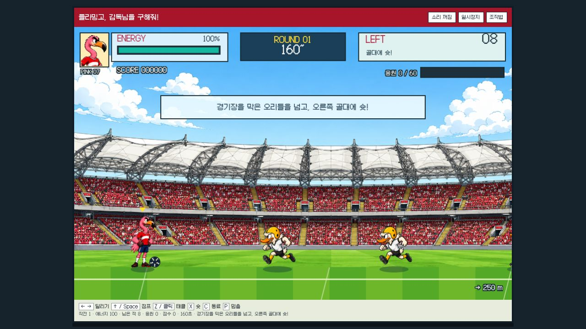

# 플라밍고, 감독님을 구해줘!

**공 하나와 두 다리로 경기장을 돌파하는 독립 축구 액션 게임.**

[](docs/browser-qa.md)

> 위 이미지는 실제 브라우저에서 점프·슈팅·태클을 입력한 플레이 캡처입니다. [브라우저 검수 범위](docs/browser-qa.md)를 별도로 기록했습니다. 사이트 배포 없이 소스·원화·로컬 실행 환경만 제공합니다.

<table>
<tr><td width="33%"><b>전반전</b><br>경기장을 돌파하고 골문에 슛</td><td width="33%"><b>하프타임</b><br>양쪽 벤치의 동료 2명 구출</td><td width="33%"><b>후반전</b><br>까마귀 대장을 넘어 감독님 구출</td></tr>
<tr><td><a href="docs/mechanics.md">경기 규칙과 입력</a></td><td><a href="docs/art-direction.md">원작 관찰과 아트 방향</a></td><td><a href="docs/assets.md">원화·폰트 출처 및 제작 프롬프트</a></td></tr>
</table>

## 로컬 실행

Node.js 22.12 이상이 필요합니다. 다른 게임 저장소 없이 단독 실행됩니다.

```sh
npm ci
npm run dev
```

[로컬 경기장 열기 · 127.0.0.1:4208](http://127.0.0.1:4208/)

포트 4208이 사용 중이면 다른 포트로 조용히 넘어가지 않고 오류를 냅니다.

```sh
npm test
npm run build
npm run capture
```

`capture`는 Node Canvas로 동일 렌더러를 실행해 CPU 미리보기를 갱신합니다. 브라우저 자동화나 브라우저 검수 결과가 아닙니다.

## 조작

| 입력 | 동작 |
|---|---|
| ← → / A D | 달리기와 방향 전환 |
| ↑ / W / Space | 점프, 내려오면서 적 밟기 |
| Z / J / 경기장 클릭 | 달리는 중 어깨 태클, 정지 중 근거리 킥 |
| X / K | 공 차기, 공중에서는 헤딩 |
| C / L | 응원 60 이상일 때 동료 3명 호출 |
| P / Escape | 일시정지 |

터치 화면의 버튼도 같은 입력 큐를 사용합니다. 키를 짧게 눌렀다 떼어도 실제로 입력을 처리한 물리 업데이트까지 행동 입력을 보존하며, 타격 정지 중에는 렌더 프레임이 지났다는 이유만으로 버리지 않습니다. 다른 탭으로 이동하거나 창 포커스를 잃으면 자동 정지하고 누르고 있던 키와 예약 입력을 해제합니다. 소리는 기본 꺼짐이며 켰을 때만 자체 합성 효과음이 재생됩니다.

## 검증 범위

`npm test`는 현재 **23개**가 통과합니다. 기존 18개에 타격 정지 중 짧은 점프 보존·단발 발동, 실제 처리된 스텝까지 모든 행동 입력 보존, 포커스 이탈/정지/재시작의 큐 초기화, 정지·0초 스텝의 입력 미소비, 키 유지로 중복 예약되지 않는지 확인하는 회귀 5개를 추가했습니다. 이 항목들은 CPU 검증이며 실제 브라우저 추가 점검과는 구분합니다.

단위·시뮬레이션 검증은 이동, 점프, 슛, 공중 헤딩, 달리기 태클, 정지, 경계, 시간 제한, 패배와 **일반 입력만 사용한 3단계 완주**를 포함합니다. 완주 테스트는 이동·점프·슛·동료 호출 입력을 실제 엔진에 넣으며 위치 순간이동, 적 삭제, HP 수정, 내부 피해 함수 직접 호출을 하지 않습니다. 이는 사람의 실제 브라우저 완주나 모든 기기에서의 검증을 의미하지 않습니다.

## 원작과의 관계

참고작은 너구리알의 「유상철, 히딩크를 구해줘」이며 [와플래시 아카이브의 원작 소개와 조작 화면](https://vidkidz.tistory.com/1382)을 관찰했습니다. 넓은 경기장 지붕·빨간 관중석, 큰 머리의 작은 선수, 달리기·어깨 태클·점프의 화면 문법을 참고했습니다. 고정 포대에서 공만 쏘는 게임이 아닙니다.

이 프로젝트의 캐릭터·경기장·코드는 새로 제작한 플라밍고 패러디입니다. 원작 SWF, 선수 사진, 음성, 음악, 스프라이트 또는 다른 게임 엔진을 포함하지 않습니다. 원작의 공식 리메이크나 제휴 작품이 아닙니다.
